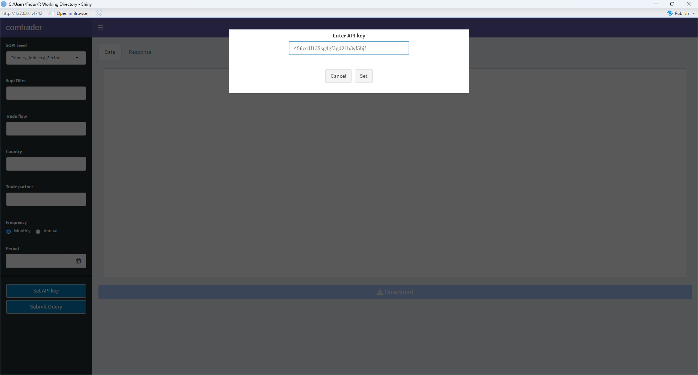

# comtrader: An R package to access UN Comtrade APIs

<!-- badges: start -->
<!-- badges: end -->

This package simplifies querying international trade data from UN Comtrade APIs. It uses [SOPI](https://www.mpi.govt.nz/resources-and-forms/economic-intelligence/situation-and-outlook-for-primary-industries/sopi-reports/) product categories to build the queries.

## Installation

You can install the development version of comtrader from [GitHub](https://github.com/) with:

``` r
# install.packages("devtools")
devtools::install_github("fededur/comtrader")
```

## Prerequisites
You need to sign in to [UN Comtrade](https://comtrade.un.org) and get a **key** to be able to connect to the API.<br/>
For further information you can visit the [UN Comtrade site](https://uncomtrade.org).

## Components

### Shiny app
  - **ctdashboard** 

To launch the app run:

``` r
library(comtrader)
ctdashboard()
```
Enter unquoted API key as shown below:

<p align="center">
  
</p>


### Support functions

Functions and data are documented in the package. You can access the documentation as shown below:

``` r
??comtrader
??comtrader::omtcodes
??comtrader::getCTSopi
```

- API access key.
  - **set_uncomtrade_key** set the API key before calling any other function.
  - **get_uncomtrade_key** retrieve the API key that is currently loaded in your system.

- Get: Model class to extract the data into tibble.
  - **ctApp** Custom get data from UN Comtrade Database API used by 'comtrader::ctdashboard'.
  - **getCTSopi** Custom get data from UN Comtrade Database API
  - **getUNC** return tibble containing trade data based on query.
  - **getTariffline** return tibble containing tariff line data based on query.

  
- DataAvailability: Model class to extract data availability.
  - **getDa** Get dataset availability from UN Comtrade Database API.
  - **getDaTariffline** Get tariff line data availability from UN Comtrade Database API (uses time ranges in query).
  - **getTariffline** Get tariff line data from UN Comtrade Database API. 
  
- Metadata: Model class to extract meta data into tibble.
  - **getLiveUpdate** Get live update data from UN Comtrade Database API.
  - **getMeatadata** Get metadata from UN Comtrade Database API.
 

- Data to support querying:
  - **omtcodes** contains NZHSC and SOPI codes and categories to assist in querying the data.
  - **hscodes** contains HS and SOPI codes and categories to assist in querying by comtrader shiny app.
  - **reportercodes** contains a named list of reporter country codes to use in comtrader shiny app.
  - **partnercodes** contains a named list of patner country codes to use in comtrader shiny app.
 
## Arguments to use in comtrader functions: 

- Selection Criteria
  - typeCode(chr) : Product type. Goods ("C") or Services ("S").
  - freqCode(chr) : The time interval at which observations occur. Annual ("A") or Monthly ("M").
  - clCode(chr) : Indicates the product (IMTS) classification used and which version ("HS", "SITC", "BEC" or "EBOPS").
  
- Query Options    
  - startDate: start date for query ("2020-01-01")
  - endDate: end date for query ("2023-01-01")
  - period(chr or num) : Combination of year and month ("202301") or just year ("2023").
  - reporterCode(chr or num) : The country or geographic area in M49 code to which the measured statistical phenomenon relates (36).
  - cmdCode(chr or num) : Product code in conjunction with classification code ("100190").
  - flowCode(chr) : Trade flow or sub-flow (exports "X", re-exports "RX", imports "M", re-imports "RM", among others).
  - partnerCode(chr or num) : The primary partner country or geographic area for the respective trade flow (36).
  - partner2Code(chr or num) : A secondary partner country or geographic area for the respective trade flow (36).
  - customsCode(chr) : Customs or statistical procedure.
  - motCode(chr) : The mode of transport used when goods enter or leave the economic territory of a country.
  - aggregateBy(chr) : Option for aggregating the query.
  - breakdownMode(chr) : Option to select the classic (trade by partner/product) or plus (extended breakdown) mode. Defaults to "classic".
  - includeDesc(boolean) : Option to include the description or not (TRUE).

## Example

This is a basic example which shows you how to solve a common query:

``` r
library(comtrader)
# 1) set key
set_uncomtrade_key(key = "jvfd5ssbgf51bgf5b") # this is a fake key it won't work!

# 2) build query
getCTSopi(reporterCode = 36,
          startDate = "2020-01-01",
          endDate = "2020-02-01",
          sopiLevel = Primary_Industry_Sector,
          sopiFilter = "Dairy")

```


