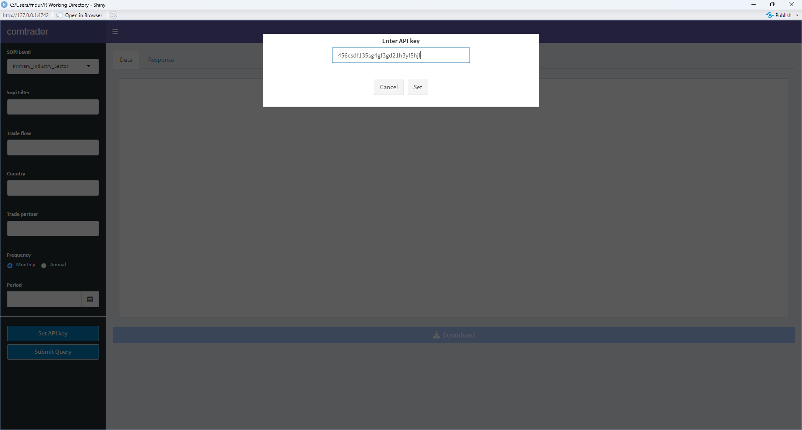

# comtrader: An R package to access UN Comtrade APIs

<!-- badges: start -->
<!-- badges: end -->

This package provides a simple and efficient way to query international trade data from [UN Comtrade](https://comtrade.un.org) APIs. It leverages [SOPI](https://www.mpi.govt.nz/resources-and-forms/economic-intelligence/situation-and-outlook-for-primary-industries/sopi-reports/) product categories to structure and build international trade queries.

In addition to the package’s core functionalities, this repository allows you to build and run the **comtrader** Shiny web application. The app is containerised using Docker for simplicity, eliminating dependency and environment configuration issues. Alternatively, you can run the app directly using RStudio. 

The `comtrader` includes functions and reference data that can be applied to other projects beyond the Shiny app.

## Getting Started

Follow the steps below to set up and run the **comtrader** Shiny app on your local machine.

## Prerequisites

Before running the app, ensure the following prerequisites are met:

#### 1. UN Comtrade Access:

- You must sign up on [UN Comtrade](https://comtrade.un.org) and obtain an API key.

- Refer to the [UN Comtrade site](https://uncomtrade.org) for additional information.


#### 2. Required tools

- **Docker**: Installed and running on your system.<br/>
  - Install Docker from [here](https://www.docker.com/)

- **Git** (Optional if cloning the repository).<br/>
  - Download and install Git from [here](https://git-scm.com/)

- **RStudio** (Optional if running the app without Docker).<br/>
  - Install RStudio from [here](https://posit.co/download/rstudio-desktop/)
  
- **Web browser**: Any modern web browser (e.g., Chrome, Firefox, Edge).


## Option A: Run using Docker 

This is the easiest and most consistent method to run the app without dealing with dependency issues.

1. Obtain the Repository Files:
  Copy the project files to your local machine using one of the following methods.

  - Clone the repository (requires Git)

    Open a Git Bash or RStudio Terminal, go to the folder for your on your machine and run:

```bash
git clone https://github.com/fededur/comtrader.git
```

  - OR download the repository as a ZIP file:

    - Click the green Code button on this page and select Download ZIP. 
    
    - Extract the contents of the Zipped file to a folder on your machine.
    

2. Ensure Docker is running:

 - Open Docker Desktop, sign in to your account, and verify it is active.

3. Run the app:
  
  - Navigate to the local repository folder in a terminal (Git Bash or RStudio terminal):

```bash
cd /path/to/comtrader
```

  - Run the shell script to build and launch the app:

```bash
./run_comtrader.sh
```

4. Access the app:
  - The app should automatically launch using your default browser at:

```bash
http://localhost:3838
```

  - Set Your API Key:
When prompted, enter your UN Comtrade API key (unquoted) as shown below. You can also set it using the Set API Key button in the app (only   need to set it once).

<p align="center">
  
</p>

  - Build your query. 
Construct and run trade queries within the app. Note that data may not always be up-to-date. Query annual data from major reporting and partnering countries, such as China or the US, for reliable results.

5. Stopping the App:

  - To stop the app, close the browser window. Go to your terminal and press `Ctrl+C` to stop the app. Follow the log in the terminal, you will be prompted with the option of stopping the containing and removing the Docker image or to leave as is (hit "y" to delete).

## Option B: Run using RStudio

If you prefer to run the app without Docker, you follow these steps to run it from the RStudio console.

1. Install `comtrader`: 

```r
# Install 'remotes' package if not already installed
if (!requireNamespace("remotes", quietly = TRUE)) {
  install.packages("remotes")
}

# Install comtrader from GitHub
remotes::install_github("fededur/comtrader")
```
2. Install package dependencies:

```r
# List of required packages
required_packages <- c("dplyr", "httr", "lubridate", "magrittr", 
                       "purrr", "rlang", "shiny", "shinydashboard", 
                       "shinyWidgets", "tibble", "tidyr", "testthat", "roxygen2")

# Install missing packages
missing_packages <- required_packages[!(required_packages %in% installed.packages()[, "Package"])]
if (length(missing_packages) > 0) {
  install.packages(missing_packages)
}

# Print status
if (length(missing_packages) == 0) {
  message("All required packages are already installed.")
}
```
3. Load `comtrader` and launch the app:

```r
library(comtrader)
comtrader::ctdashboard()
```
4. Set Your API Key:

Enter your UN Comtrade API key (unquoted) when prompted.

5. Use:
  
  - Build your query.
  
  - To stop the app, click the "Stop" button in RStudio or press the "Escape" key in the R console.


## `comtrader` package components

### Shiny app
  - **ctdashboard** 

### Support functions

Functions and data are documented in the package. You can access the documentation as shown below:

``` r
library(comtrader)
??comtrader # package documentation
??omtcodes # data documentation
??getCTSopi # function documentation
```

- API access key.
  - **set_uncomtrade_key** set the API key before calling any other function.
  - **get_uncomtrade_key** retrieve the API key that is currently loaded in your system.

- Get: Model class to extract the data into tibble.
  - **ctApp** Custom get data from UN Comtrade Database API used by 'comtrader::ctdashboard'.
  - **getCTSopi** Custom get data from UN Comtrade Database API
  - **getUNC** return tibble containing trade data based on query.
  - **getTariffline** return tibble containing tariff line data based on query.

  
- DataAvailability: Model class to extract data availability.
  - **getDa** Get dataset availability from UN Comtrade Database API.
  - **getDaTariffline** Get tariff line data availability from UN Comtrade Database API (uses time ranges in query).
  - **getTariffline** Get tariff line data from UN Comtrade Database API. 
  
- Metadata: Model class to extract meta data into tibble.
  - **getLiveUpdate** Get live update data from UN Comtrade Database API.
  - **getMeatadata** Get metadata from UN Comtrade Database API.
 

- Data to support querying:
  - **omtcodes** contains NZHSC and SOPI codes and categories to assist in querying the data.
  - **hscodes** contains HS and SOPI codes and categories to assist in querying by comtrader shiny app.
  - **reportercodes** contains a named list of reporter country codes to use in comtrader shiny app.
  - **partnercodes** contains a named list of patner country codes to use in comtrader shiny app.
 
## Arguments to use in comtrader functions: 

- Selection Criteria
  - typeCode(chr) : Product type. Goods ("C") or Services ("S").
  - freqCode(chr) : The time interval at which observations occur. Annual ("A") or Monthly ("M").
  - clCode(chr) : Indicates the product (IMTS) classification used and which version ("HS", "SITC", "BEC" or "EBOPS").
  
- Query Options    
  - startDate: start date for query ("2020-01-01")
  - endDate: end date for query ("2023-01-01")
  - period(chr or num) : Combination of year and month ("202301") or just year ("2023").
  - reporterCode(chr or num) : The country or geographic area in M49 code to which the measured statistical phenomenon relates (36).
  - cmdCode(chr or num) : Product code in conjunction with classification code ("100190").
  - flowCode(chr) : Trade flow or sub-flow (exports "X", re-exports "RX", imports "M", re-imports "RM", among others).
  - partnerCode(chr or num) : The primary partner country or geographic area for the respective trade flow (36).
  - partner2Code(chr or num) : A secondary partner country or geographic area for the respective trade flow (36).
  - customsCode(chr) : Customs or statistical procedure.
  - motCode(chr) : The mode of transport used when goods enter or leave the economic territory of a country.
  - aggregateBy(chr) : Option for aggregating the query.
  - breakdownMode(chr) : Option to select the classic (trade by partner/product) or plus (extended breakdown) mode. Defaults to "classic".
  - includeDesc(boolean) : Option to include the description or not (TRUE).

## Example

This is a basic example which shows you how to solve a common query:

``` r
library(comtrader)
# 1) set key
set_uncomtrade_key(key = "jvfd5ssbgf51bgf5b") # this is a fake key it won't work!

# 2) build query
getCTSopi(reporterCode = 36,
          startDate = "2020-01-01",
          endDate = "2020-02-01",
          sopiLevel = Primary_Industry_Sector,
          sopiFilter = "Dairy")

```


